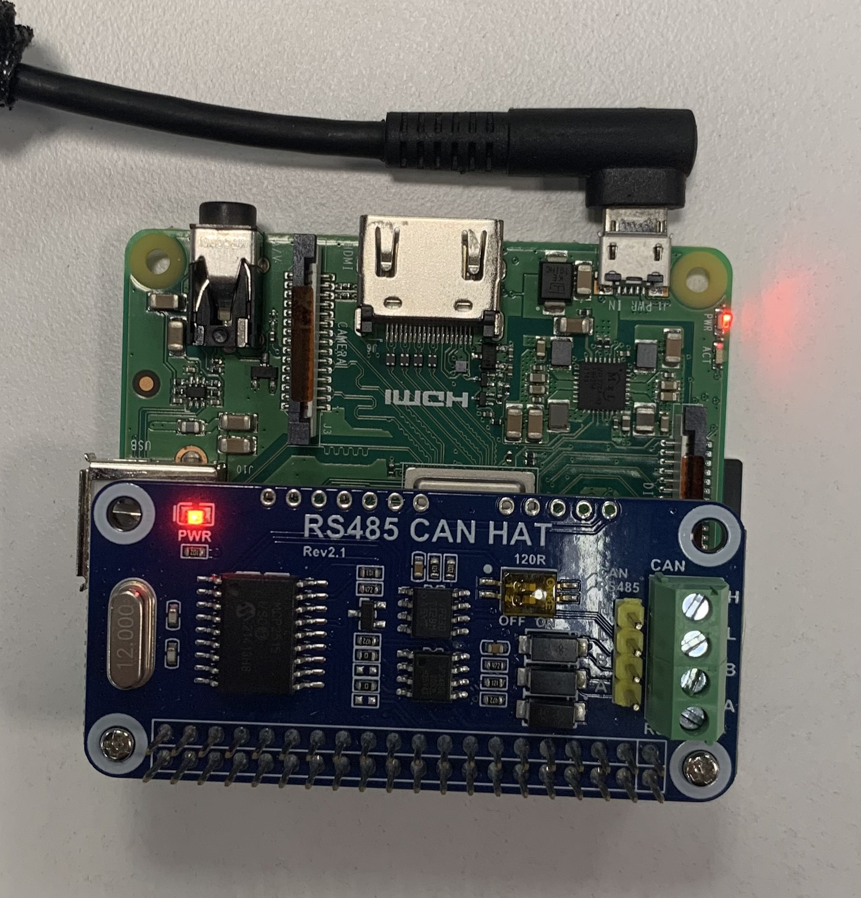
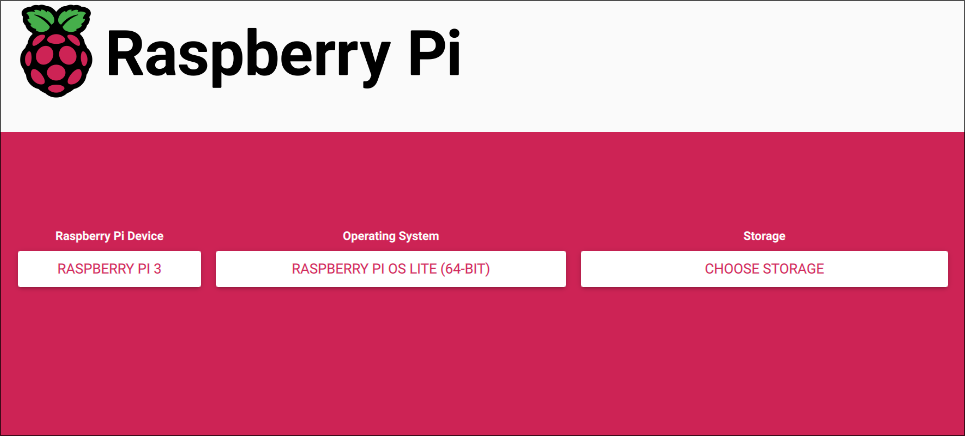

Inverter to Grafana

By directly accessing customers’ inverters, it removes the need to rely on third-party software and also provides greater insight and analysis into the solar PV system. Not only is this solution cost-effective, it is relatively easy to implement, requiring simple hardware and minimal knowledge.

# Hardware
**Raspberry Pi 3A+**

Specs

- Built in Wi-Fi with 2.4/5GHz support
- Populated 40-pi GPIO header
- 512 MB RAM
- micro-USB power port
- HDMI and USB 2.0 port
- MicroSD card slot

This is the ideal model due to its in-build features that do not require additional attachments, which may complicate the installation process. Its relatively small size allows it to be installed easily alongside the inverter.

Price: MYR 135 (Cytron)

**WaveShare RS485 Can Hat**

This allows the Pi to access the inverter via the RS485 port

Price: MYR 65 (Cytron)

**Miscellaneous**

- 5V/2.5A micro-USB power supply

   A 5V/2.5A power supply is important, as a weaker supply may cause the Pi to underperform or not turn on at all, while a stronger supply may cause heating issues that will reduce its lifespan and damage the Pi in the long run.

- TP-Link TL-WN727N Wi-Fi antenna (optional)


   If the Pi is unable to connect to the client's Wi-Fi due to location or the material of the combiner box, a Wi-Fi antenna may help with this.


- Micro-SD card
- Case


# Installation
## Manual installation
Required software:

- PuTTy (https://www.chiark.greenend.org.uk/~sgtatham/putty/latest.html)
- Raspberry Pi Imager (https://www.raspberrypi.com/software/)
- Nmap (https://nmap.org/download#windows)

### OS Setup
Attach the can hat to the Pi’s pins as shown below.\


Insert the MicroSD car into your laptop and laucnh the Raspberry Pi Imager.
Select Raspberry Pi 3 for the model and Raspberry Pi OS Lite, which can be found by going to `Choose OS -> Raspberry Pi OS (Other) -> Raspberry Pi OS Lite (64-bit)` and select the microSD card's model for Storage.


Select `Next -> Edit Settings` and configure the settings as shown below.
\
>**NOTE**: Change the hostname from "tutorial" to the customer's name, and ensure it is unique. Wi-Fi is the office router's SSID and password. Remember the username and password as it will be used to login into the Pi later on.

Enable SSH with password authentication.\


Apply the changes and allow the program to write to the SD card. Once complete, insert the SD card into its designated slot under the Pi and boot it up with the micro-USB adapter. Give it a few minutes to setup.

### Connecting to the Pi

To connect to the Pi via SSH, you will need the Pi's IP address. \
First launch Command Prompt and enter this command:
```
ipconfig
```
Under the `Wireless LAN adapter Wi-Fi` section, copy down the first 3 numbers of the IPv4 address, which is the network ID.
> **EXAMPLE:** If the IPv4 address is 10.69.0.58, the network ID is 10.69.0

Next, enter this command:
```
nmap -sn <NETWORK_ID>.1/24
```
This will scan for all devices connected to the same network. It should output a list of devices and their address. Find the entry with the name "Raspberry Pi" and note down its address.

**EXAMPLE**
```
$ nmap -sn 10.69.0.1/24
Nmap scan report for 10.69.0.58
Host is up (0.066s latency).
MAC Address: AC:67:5D:B1:36:18 (Intel Corporate)
Nmap scan report for 10.69.0.59
Host is up (0.0056s latency).
MAC Address: 6C:24:08:AF:85:EF (LCFC(HeFei) Electronics Technology)
Nmap scan report for 10.69.0.61
Host is up (0.13s latency).
MAC Address: 2C:CF:67:36:10:5F (Raspberry Pi (Trading))
```
The Pi's address is then 10.69.0.61.

Launch PuTTy and connect to this address. A pop-up should appear. Select Accept and continue.

A login prompt should appear. Enter the username and password you entered previously when installing the OS.

Enter the raspi-config screen.
```
sudo raspi-config
```
A blue screen with options should appear. Using your arrow keys, Choose `System Options -> Boot/ Auto Login -> Console AutoLogin`. It should bring you back to the home screen.\
Next choose `Interface Options -> Serial Port -> No -> Yes`.\
Choose `Finish -> No` to return back to the terminal.

Due to restrictions on the TIME network, you must also manually set the time and date.
```
sudo date -s "<DAY> <MONTH> <DATE> <HH>:<MM>:<SS> UTC <YYYY>"
```
>**NOTE:** The time must be in UTC

Next update the system and install git, then clone and navigate to this repository.
```
sudo apt-get update
sudo apt-get upgrade
sudo apt-get install git
git clone https://github.com/xyberii4/emit-monitoring-pi.git
cd emit-monitoring-pi
```
Next, you must modify the telegraf configuration file to match the customer's details.\
There should be two files, starting with either `huawei` or `growatt`. Open the correct file with this command:
```
nano <INVERTER>_telegraf.conf
```
Replacing \<INVERTER\> with the corresponding brand.\

At the top of the file, under the `[global_tags]` section, there are two variables, `station` and `capacity`. Enter the customer's name in between the quotation marks for `station`, and replace any spaces with `_`. Do the same for capacity, in watts.

>**EXAMPLE**
```toml
[global_tags]
station = "test_123"
capacity = "9860"
```
Save the file with `Ctrl-o` + `Enter` + `Ctrl-x`.

Next, execute the `setup.sh` file.
```
sudo ./setup.sh
```
This will setuo the CAN HAT and install telegraf and rpi-connect.
A prompt will also ask you if the customer's inverter is Huawei or Growatt.
Once complete, the Pi will reboot.


